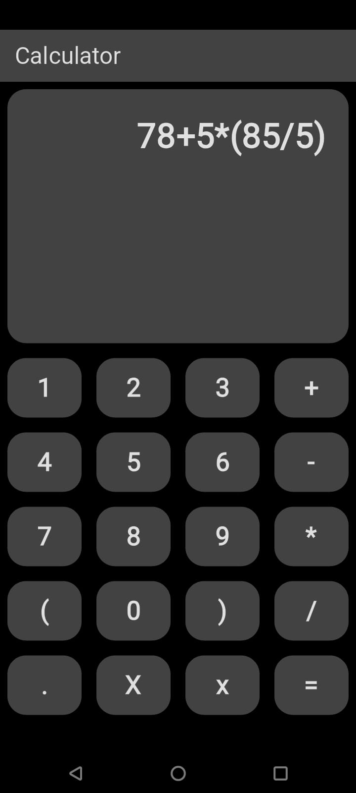

# 📱 Calculator App (Flutter)

A simple calculator built using **Flutter**.  
It supports basic arithmetic operations including addition, subtraction, multiplication, division, parentheses, and decimal numbers.

---

## ✨ Features

- Basic operations: `+`, `-`, `*`, `/`
- Support for parentheses `( )`
- Decimal numbers support
- Clear all (`X`) and backspace (`x`) functionality
- Responsive and clean UI
- Error handling for invalid expressions

---

## 🛠️ Tech Stack

- Flutter
- Dart

---

## 🚀 Getting Started

### Prerequisites

- Flutter installed on your machine.  
  [Install Flutter](https://docs.flutter.dev/get-started/install)

### Installation

```bash
# Clone the repository
git clone https://github.com/your-username/calculator_app.git

# Install dependencies
flutter pub get

# Run the app
flutter run
```

---

## 📷 Screenshots



---

## 📄 Code Highlights

- Manual parsing and evaluation of mathematical expressions
- Proper operator precedence handling
- Dynamic UI updates on button presses
- Separate handling for decimal points inside numbers
- Parentheses handling for correct order of operations

---

## 📢 Future Improvements

- Add calculation history
- Add scientific functions (sin, cos, tan, log, etc.)
- Improve UI animations
- Theme customization (more themes)

---

## 🤝 Contributing

Contributions are welcome!  
Feel free to open an issue first to discuss what you would like to change.  
Fork the project, make your changes, and submit a pull request.

---

## 🪪 License

This project is licensed under the MIT License.  
See the [LICENSE](LICENSE) file for details.

---

## Download Now

https://drive.google.com/drive/folders/1Y4E8k3ZHZq2bynjrehS6h1ztam_rc7uk
